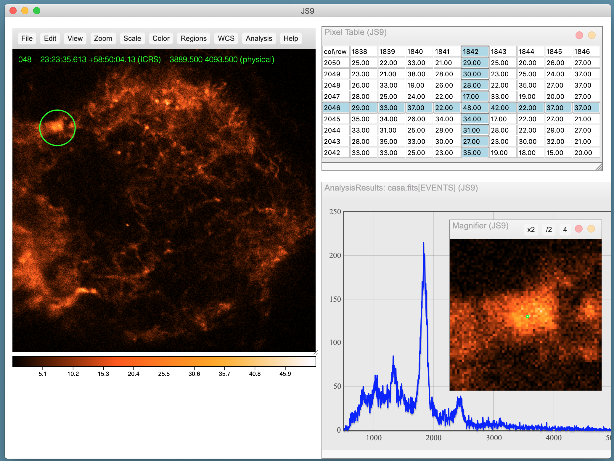

js9app: a simplified JS9 desktop app (based on Electron.js)
=============================================================

What is it?
-----------

You can install a self-contained Mac desktop app for the JS9
image display program.

Of course, the full version at https://github.com/ericmandel/js9
offers more flexibility (you can tailor the user interface, add plugins,
add server-side analysis tasks, retrieve updates easily, etc.), but
this app will suffice for many needs.

How do I install it?
--------------------

Download the .pkg file from the main JS9 website:

https://js9.si.edu/downloads/js9-3.1.0.pkg

Double-click the downloaded file and follow the instructions to
install the js9.app into the Applications folder.

Using the Finder, drag the js9.app folder onto the Dock and click to
start it up.

Can I use scripting with this version of JS9?
---------------------------------------------

Once the js9 app is running, you can save the *js9msg* script into your home
directory by selecting the *File: save messaging script* menu option.  This
script is identical to the *js9* script that comes with the full JS9 repository,
but is configured to know where you have installed the js9 app.

The *js9msg* script allows you to control JS9 from the command line using
the JS9 Public API:

    js9msg Load chandra.fits '{"scale":"log","colormap":"red","contrast":5.78,"bias":0.15}'
    js9msg Load spitzer.fits '{"scale":"log","colormap":"blue","contrast":6.3,"bias":0.54}'
    js9msg ReprojectData chandra.fits

Can I run server-side analysis tasks?
-------------------------------------

The Analysis menu contains entries for Funtools-based tasks such as
*FITS Header(s)*, *Counts in Regions*, and *Radial Profile*, which
have already been installed in the js9 app.

Can I change/configure the JS9 files that come with the app?
------------------------------------------------------------

Yes, you can! The JS9 files are contained in this folder:

    /path/to/js9.app/Contents/Resources/app

So, for example, you can edit the js9prefs.js file and set up
site-wide preferences. Or you can edit/replace the js9.html file that
defines the desktop's web page interface. But ... but ... at that
point, shouldn't you just clone the main repository and do the quick build:

    git clone https://github.com/ericmandel/js9
    cd js9

Then install Electron.js from https://github.com/electron/electron/releases
and run the js9 script in its full desktop glory:

    js9 -a --webpage ~/myjs9pages/js9info.html ~/data/casa.fits '{"colormap":"cool", "scale":"log"}'

Where can I find out more about JS9 itself?
-------------------------------------------

Visit the main JS9 web site:

    https://js9.si.edu

or the JS9 GitHub repository:

    https://github.com/ericmandel/js9

What's the license?
-------------------

JS9 is distributed under the terms of The MIT License.

Who's responsible?
------------------

Eric Mandel, Alexey Vikhlinin

Center for Astrophysics | Harvard & Smithsonian
