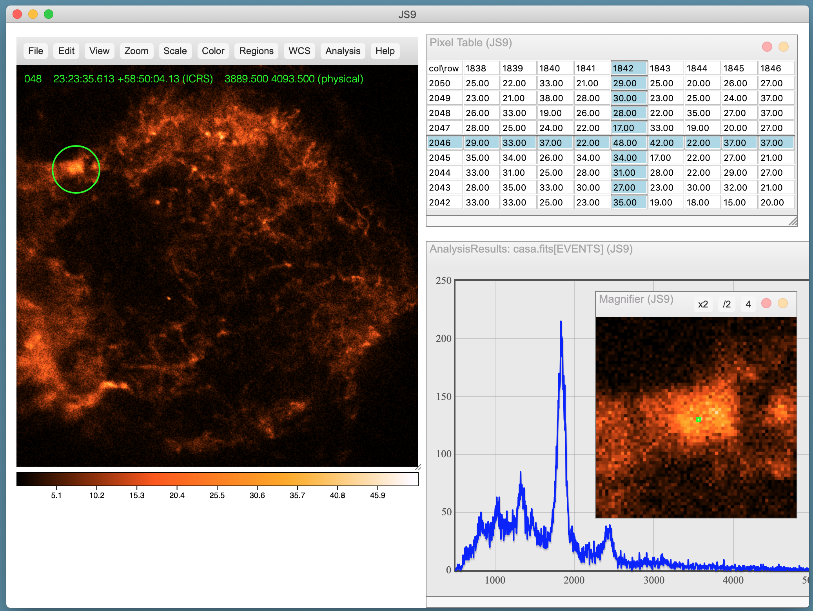
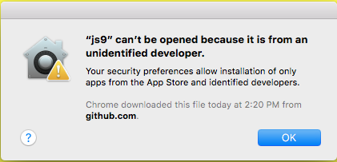
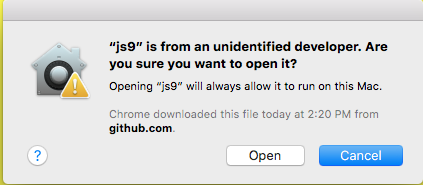

js9app: a simplified JS9 desktop app (based on Electron.js)
=============================================================

What is it?
-----------

The zip file(s) in this repository contain self-contained desktop app(s) for
the JS9 image display program. Currently, we offer a Mac version, which
has been tested on MacOS High Sierra (10.13) and Mojave (10.14).

This repository allows you to download and unpack a single zip file and
run JS9 as a GUI-based program (instead of building/installing desktop JS9
from its GitHub repository and running it from the command line.) Of course,
the full GitHub version offers more power and flexibility (allowing you
to tailor your own interface, add plugins, add server-side analysis
tasks, retrieve updates easily, etc.), but this app will be useful for
less complex needs.

NB: This repository is not updated each time the JS9 repository is
updated. If you want to use the latest version of JS9, please clone
the main JS9 repository.

How do I install it?
--------------------

Clone the js9app repository:

    git clone https://github.com/ericmandel/js9app

or visit the repository and click 'Clone or download'.

Unzip the downloaded Mac file into /Applications or $HOME/Applications:

    cd /Applications
    unzip /path/to/js9-macos.app.zip

Using the Finder, drag the js9.app folder onto the Dock and click to
start it up.

Depending on your security preferences, you might see this error dialog box:

Click *OK* and then *right-click* the js9 icon in the Dock and
choose the *Open* menu option to see this confirmation dialog:

Click *Open* to run the app without interference from now on.

Can I use scripting with this version of JS9?
---------------------------------------------

The supplied *js9* script allows you to control a JS9 from the command
line using the JS9 Public API. It is located here:

     /path/to/js9.app/Contents/Resources/app/bin/js9

You can either call it using the full path or copy it to a more convenient bin
directory. Call it in the usual way:

    js9 Load chandra.fits '{"scale":"log","colormap":"red","contrast":5.78,"bias":0.15}'
    js9 Load spitzer.fits '{"scale":"log","colormap":"blue","contrast":6.3,"bias":0.54}'
    js9 ReprojectData chandra.fits

Can I run server-side analysis tasks?
-------------------------------------

The Analysis menu contains entries for Funtools-based tasks such as
*FITS Header(s)*, *Counts in Regions*, and *Radial Profile*.  These
tasks will only run if you install the Funtools package from
https://github.com/ericmandel/funtools. Clone and build funtools in
the usual way, e.g:

    git clone https://github.com/ericmandel/funtools
    cd funtools
    ./configure --prefix=$HOME
    make
    make install

assuming you have previously installed the Mac Xcode development environment.

Can I change/configure the JS9 files that come with the app?
------------------------------------------------------------

Yes, you can! The JS9 files are contained in this folder:

    /path/to/js9.app/Contents/Resources/app

so, for example, you can edit the js9prefs.js file and set up
site-wide preferences. But ... but ... at that point, shouldn't you
just clone the main repository and do the quick build:

    git clone https://github.com/ericmandel/js9
    cd js9
    ./mkjs9 -q

Where can I find out more about JS9 itself?
-------------------------------------------

Visit the main JS9 web site:

    https://js9.si.edu

or the JS9 GitHub repository:

    https://github.com/ericmandel/js9

What's the license?
-------------------

JS9 is distributed under the terms of The MIT License.

Who's responsible?
------------------

Eric Mandel, Alexey Vikhlinin

Center for Astrophysics | Harvard & Smithsonian
